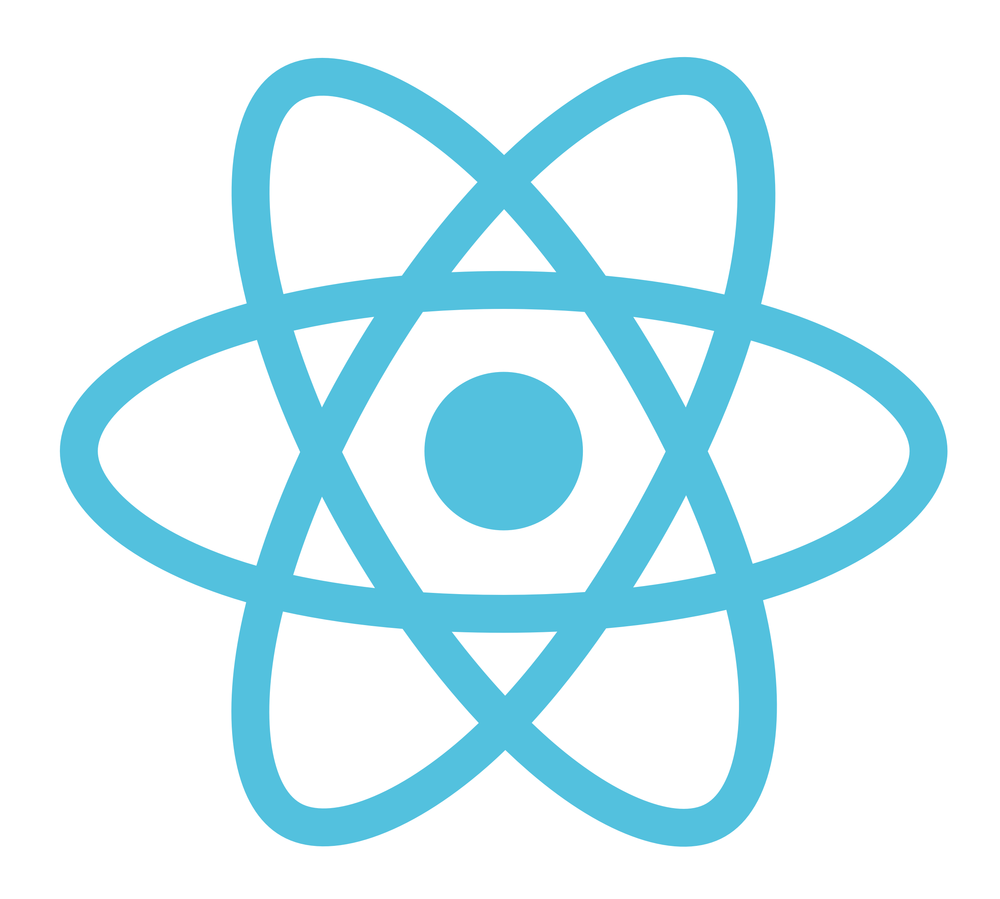

# React Boilerplate

Project creating [React](https://reactjs.org/) application [boilerplate](https://medium.freecodecamp.org/whats-boilerplate-and-why-do-we-use-it-let-s-check-out-the-coding-style-guide-ac2b6c814ee7) with [webpack](https://webpack.js.org/) and [Babel](https://babeljs.io/).



Follow along with [React &amp; Webpack 4 From Scratch](https://www.youtube.com/watch?v=deyxI-6C2u4) tutorial on YouTube.

## Prerequisites

- Terminal
- Git
- Node, NPM
- HTML, CSS, JS

## Git

### From scratch

`git init`

### From clone

```shell
git clone https://github.com/astron-nautes-limited/react-babel-webpack.git
npm install
```

## README

The file you are reading now. It is good practice to update this file as you go along.

### .gitignore

Always add this file to the root of your repository. 

- .DS_Store
- node_modules

## Node Package Manager

`npm init`

## Dependencies

`npm install react react-dom`

- [react](https://reactjs.org/docs/react-api.html)
- [react-dom](https://reactjs.org/docs/react-dom.html)

## Dev Dependencies

### [Webpack](https://webpack.js.org)

`npm install -D webpack webpack-cli webpack-dev-server html-webpack-plugin`

- webpack
- webpack-cli
- webpack-dev-server
- html-webpack-plugin

#### [Webpack Config](https://webpack.js.org/configuration/)

Create `webpack.config.js` file at `root`

Add code to `webpack.config.js`

```jsx
const path = require('path');
const HtmlWebpackPlugin = require('html-webpack-plugin');

module.exports = {
    mode: 'development',
    entry: './src/index.js',
    output: {
        path: path.join(__dirname, '/dist')
        filename: 'bundle.js'
    },
    module: {
        rules: [
            {
                test: /\.js$/,
                exclude: /node_modules/,
                use: {
                    loader: 'babel-loader'
                }
            }
        ]
    },
    devServer: {
        contentBase: './dist'
      },
    plugins: [
        new HtmlWebpackPlugin({
            template: './src/index.html'
        })
    ]
}
```

Create `src` directory at `root` 

Create `index.js` file in `src` directory

#### [HTML Webpack Plugin](https://github.com/jantimon/html-webpack-plugin)

##### Writing Your Own HTML Webpack Templates

Create `index.html` file in `src` directory

Update code in `package.json`

Replace

```shell
"scripts": {
    "test": "echo \"Error: no test specified\" && exit 1"
  },
```

With

```shell
 "scripts": {
    "start": "webpack-dev-server --mode development --open --hot",
    "build": "webpack --mode production" 
  },
```

### Babel

`npm install -D @babel/core @babel/preset-env @babel/preset-react babel-loader`

- @babel/core
- @babel/preset-env
- @babel/preset-react
- [babel-loader](https://github.com/babel/babel-loader)

Create `.babelrc` file at `root`

Add code to `.babelrc`

```shell
{
    "presets": ["env", "react"]
}
```

Create `components` directory at `src` 

Create `App.js` file in `components` 

Add code to `App.js`

```jsx
import React, { Component } from 'react';

class App extends Component {
    render() {
        return(
            <div>
                <h1>Chemical Reaction</h1>
                <p>Process leading transformation of chemical substances into other chemicals.</p>
            </div>
        );
    }
}

export default App;
```

Add code to `index.js`

```jsx
import React from 'react';
import ReactDOM from 'react-dom';
import App from './components/App';

ReactDOM.render(<App />, document.getElementById('app'));
```

`npm start`

## Errors

- [Complete log of npm start run on React Boilerplate project](https://gist.github.com/earth2travis/ba2d2a07358107edf4455feaf9c080a9)